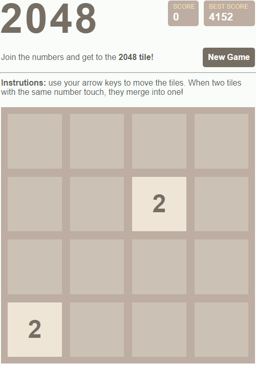

# 2048

A clone of the game 2048

## Description

This is a clone of the original game [2048](https://2048game.com/) written by
Gabriele Cirulli in JS.

## How to play

Use the keyboard arrow keys &larr;, &uarr;, &darr; and &rarr; to move the tiles.  
Merge equal tiles until get a 2048. The game is won when a tile with a value of 2048 appears on the board.  
But you can continue to get higher scores.

## Preview

## How to use

Clone the project and click the index.html file. That's it!